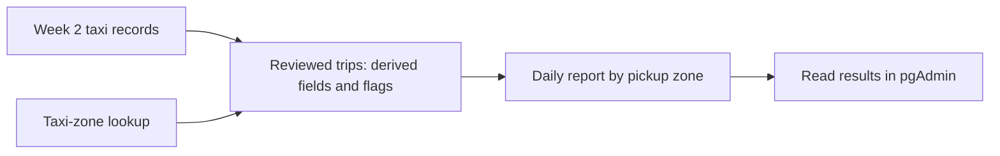

# Week 4 — Transformation, serving, and protecting identifiers

[Module homepage](../../README.md) · [Downloads before class](../../preparation/week-04.md)

Week 2 made taxi records available in PostgreSQL. This week we make those records useful for a specific question: **How many selected trips started in each pickup zone on each day, and what was their combined fare amount?**

By the end, you should be able to explain an ingestion choice, define a reporting rule, enrich and aggregate data with SQL, and show how an analyst can use customer tokens without reading the original identifiers.

The source records stay in place. SQL views provide different ways to query them. A **view** is a saved query: PostgreSQL runs its query when you read the view. It does not store a separate copy of the results.

## 1. Explain what you already built

Draw the Week 2 source, Python loader, PostgreSQL server, and pgAdmin client. Label who requests the file and when records become available.

Discuss with a partner:

- Why is this **batch** ingestion even though Python processes 10,000 records at a time?
- Who initiates the download: the source or our loader?
- Does downloading February tell us which January records were corrected or deleted?
- Could monthly published files support an alert about congestion happening now?

Finish with a sentence explaining **batch + pull + full-file ingestion**. Processing a file in small batches does not turn it into streaming. Loading another month is not change data capture (CDC): our source does not provide individual update and delete events.

## 2. Build the practical results

Follow these in order:

1. [Taxi transformation and reporting](part-1-transformation.md).
2. [Tokenization and access](part-2-tokenization.md).

Use your existing PostgreSQL, pgAdmin, and Python image. No cloud account or new service is required. The report uses `public.taxi_trips_monthly`, loaded in Week 2 Part 3, Step 7. Finish loading at least one month before starting; you can also work with the full year of 2024.

## Finish with

- A daily report with documented inclusion rules and matching record counts.
- One example of a flagged record, or a statement that your loaded data contained none of that kind.
- A successful token-based query and an expected permission-denied result.
- Your updated project diagram and decisions.

## References

- [TLC trip data and taxi-zone lookup](https://www.nyc.gov/site/tlc/about/tlc-trip-record-data.page)
- [PostgreSQL views](https://www.postgresql.org/docs/18/sql-createview.html)
- [PostgreSQL SET ROLE](https://www.postgresql.org/docs/18/sql-set-role.html)
