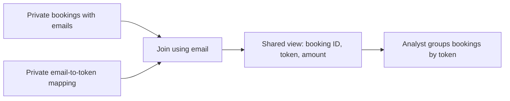

# Week 4 — Part 2: Tokenization and access

[Week 4 overview](README.md) · [Previous: transformation](part-1-transformation.md)

## Scenario — A booking company's analyst needs customer totals

In Part 1, we prepared taxi records for a report. Now we explore another question: **how can we make data useful to an analyst while restricting access to customer identifiers?** This connects to the slides on tokenization and least privilege.

Imagine a small booking company. Its booking system records the customer's email address and the amount paid for each booking. An analyst wants to know how many bookings each customer made and how much they spent. The analyst needs to recognize bookings belonging to the same customer, but does not need to know that customer's email address.

## The data we will use

For this exercise, we introduce **two fictional customers and three bookings**:

| Booking ID | Customer email | Amount (USD) |
|---|---|---:|
| 1 | `alex@example.com` | 12.00 |
| 2 | `alex@example.com` | 18.00 |
| 3 | `sam@example.com` | 25.00 |

Alex has two bookings totalling 30.00 USD; Sam has one booking totalling 25.00 USD. These are the results the analyst should be able to calculate without seeing either email.

These records are a separate teaching dataset, not part of the NYC taxi files. Our taxi data has no passenger-email field. The records above are already included as `INSERT` statements in [05-tokenization.sql](../../examples/nyc-taxi/sql/week4/05-tokenization.sql). You do not need to download a file or provide any real customer information. Running the setup in Step 2 creates this data in the same `ny_taxi` database, in separate schemas from the taxi tables.

## Goal — Keep customer relationships, restrict access to emails

A **token** is a substitute identifier. We will generate one random identifier for each customer and use it in place of their email in the analyst's view. For illustration, Alex's two bookings could both show `customer_A`, and Sam's booking could show `customer_B`. The actual script generates longer random identifiers called **UUIDs**.

Simply removing emails would lose the link between a customer's bookings. Keeping the same token across those bookings lets the analyst group them correctly. A restricted table retains the **mapping**: which email belongs to which token.

You will create the fictional records and mapping, expose a view containing tokens and booking amounts, and test the analyst's permissions. By the end, the analyst's totals query should succeed, while a query for the original emails should be denied.



The analyst can use the shared view but cannot read the private mapping. This exercise demonstrates database tokenization and permissions, not a production token vault. Tokens still link a person's records; they do not automatically make the data anonymous.

## Step 1 — Read the setup before running it

Open [05-tokenization.sql](../../examples/nyc-taxi/sql/week4/05-tokenization.sql). It creates:

| Object | Purpose |
|---|---|
| `week4_private.customers` | Stores fictional emails and their random tokens. |
| `week4_private.bookings` | Stores three fictional bookings with their source emails. |
| `week4_shared.bookings` | A view exposing tokens and amounts, without emails. |
| `deng_week4_analyst` | A role with permission to read the shared view. |

`gen_random_uuid()` creates a random identifier; it does not encrypt the email or calculate a hash from it. `DEFAULT` generates this value when we insert a customer without specifying a token. The primary key on email ensures one mapping per customer.

`ON CONFLICT ... DO NOTHING` keeps existing rows when the script runs again, so the tokens stay stable. The short `DO` block creates the role only if it does not already exist.

**Predict:** How many different tokens should the analyst see for three bookings belonging to two customers?

## Step 2 — Create the fictional data and permissions

Use pgAdmin's Query Tool connected to `ny_taxi` with your Week 2 administrator account. Run the entire [05-tokenization.sql](../../examples/nyc-taxi/sql/week4/05-tokenization.sql) file. Its `BEGIN` and `COMMIT` keep the setup in one transaction.

`GRANT` gives a permission; `REVOKE` removes a permission. `PUBLIC` here means all database roles, not the schema named `public`. The analyst receives schema `USAGE` (permission to access objects in that namespace) and `SELECT` on the shared view. The analyst gets no access to the private schema.

The view is owned by the administrator. PostgreSQL's default view permissions allow its owner to read the underlying tables while granting the analyst only access to the view's selected fields.

**Finish with:** two customers, three bookings, and a shared view. Rerunning this setup keeps the same fixture records and tokens.

## Step 3 — Query with analyst permissions

Open [06-check-access.sql](../../examples/nyc-taxi/sql/week4/06-check-access.sql). **Run its numbered blocks one at a time**, not the whole file.

In the Query Tool toolbar, enable **Auto commit**: hover over the controls to find its name. Each standalone statement should finish its transaction automatically. This matters because one statement below is deliberately denied.

First, inspect the mapping as the administrator. Then switch to the analyst role:

```sql
SET ROLE deng_week4_analyst;
```

Check which role is active:

```sql
SELECT current_user;
```

The result should show `deng_week4_analyst`. `SET ROLE` changes the permissions used by this connection. This role has `NOLOGIN`, so we demonstrate its permissions through our administrator connection rather than creating another login and password.

**Check that reading the shared view is allowed:**

```sql
SELECT * FROM week4_shared.bookings;
```

This should succeed and show three bookings with booking IDs, customer tokens, and amounts, but no emails.

Then run the grouped query in block 3. Expect two result rows: one token with **2 bookings and 30.00 USD**, another with **1 booking and 25.00 USD**. Your random token values will differ from your partner's.

**Check that reading the private mapping is denied** (block 4):

```sql
SELECT * FROM week4_private.customers;
```

Expect **permission denied for schema week4_private**. This is the intended result: the analyst can read the shared view but cannot read the email-to-token mapping.

Finally, execute block 5 separately:

```sql
RESET ROLE;
```

Then confirm that your administrator role is active again:

```sql
SELECT current_user;
```

This restores your administrator identity. If you accidentally used an open transaction and see “current transaction is aborted,” run `ROLLBACK;` first, then `RESET ROLE;`.

**Finish with:** a successful query using tokens and a denied query for the mapping. If the mapping query succeeds, check `current_user`; you may still be using administrator permissions.

## Step 4 — Explain the boundary

Discuss with a partner:

- Why can the administrator recover an email while the analyst cannot?
- Why must the token stay the same across a customer's bookings?
- Would displaying `a***@example.com` provide the same mapping mechanism? That is masking: hiding parts of the displayed value.
- How does encryption differ? Encryption produces ciphertext that an authorized system can decrypt with a key; this exercise uses a stored mapping instead.
- Where should an ingestion pipeline replace sensitive identifiers before exposing data to analysts?

Our source emails stay in restricted tables, and substitution happens in a view at query time. A pipeline that must avoid storing emails in its analytical database would tokenize **before loading into that destination**, keeping the mapping in a separately protected system.

An administrator can use `RESET ROLE` to regain access; this demonstration does not take away administrator powers. A real analyst would use a separate restricted login. Hiding an email column alone is also insufficient if the analyst can still query the original table.

Return to the [project discussion](README.md#3-apply-the-decisions-to-your-project).
