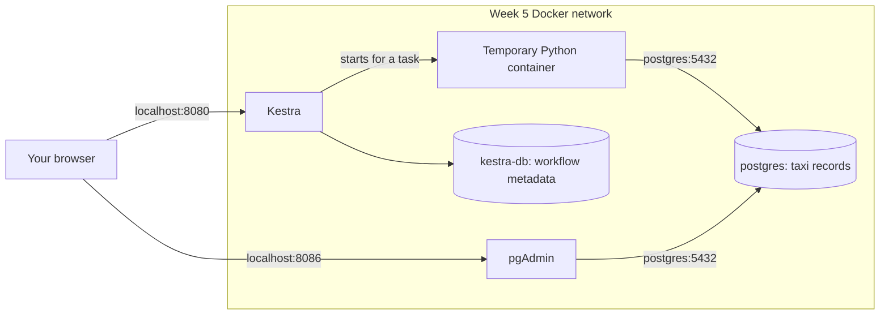

# Week 5 — Workflow orchestration with Kestra

[Module homepage](../../README.md) · [Downloads before class](../../preparation/week-05.md)

**Everything needed for this week's practical is in this folder.** It has its own database, pgAdmin, Python loader, SQL, and configuration. You do not need to start another week's environment.

## 1. Four services, one Compose file

| Service | Purpose |
|---|---|
| `postgres` | Stores this week's taxi records. |
| `pgadmin` | Browser interface for querying the taxi database. |
| `kestra` | Runs workflows and shows their logs and execution history. |
| `kestra-db` | Stores Kestra's internal information, not taxi records. |



One Compose file starts four separate containers. A flow starts an additional temporary Python container when needed. All use the Week 5 network. The Python image contains the Week 5 Python scripts and their dependencies.

## 2. Set up this week's folder

Start Docker. From the repository root:

```sh
cd weeks/05-workflow-orchestration
```

**All remaining terminal commands run here.** Complete the [Week 5 preparation checklist](../../preparation/week-05.md) to download the images and taxi files and build the Python image.

Copy `.env.example` to `.env` once:

```sh
cp .env.example .env
```

On Windows PowerShell, use `Copy-Item .env.example .env`. If `.env` already exists, keep it and add any missing settings from `.env.example`.

Open `.env` and replace the four example passwords. The Kestra login password needs at least eight characters, including an uppercase letter, a lowercase letter and a number. `KESTRA_USER` is an email-format local login name.

| Settings | Used for |
|---|---|
| `KESTRA_USER`, `KESTRA_PASSWORD` | Signing into Kestra |
| `KESTRA_DB_PASSWORD` | Kestra connecting to its internal database |
| `POSTGRES_DB`, `POSTGRES_USER`, `POSTGRES_PASSWORD` | Connecting to the taxi database |
| `PGADMIN_DEFAULT_EMAIL`, `PGADMIN_DEFAULT_PASSWORD` | Signing into pgAdmin |
| `TAXI_DATA_DIR` | The absolute path to this folder's `data/` directory |

Find your data folder's absolute path:

```sh
cd data
pwd
cd ..
```

On Windows PowerShell, use `(Resolve-Path data).Path.Replace('\', '/')` instead. Put the result in `.env`, for example:

```dotenv
TAXI_DATA_DIR=/Users/your-name/course-repo/weeks/05-workflow-orchestration/data
```

This is the only absolute path to configure. Docker needs the laptop path when Kestra starts a task container and mounts the prepared files. Keep `.env` private; Git ignores it.

## 3. Start the environment

```sh
docker compose config --quiet
docker compose up -d
```

Compose automatically reads **this folder's `.env` and `compose.yaml`**. You do not need `--env-file`, `-f`, or another week's files.

The first command checks the configuration without starting services. The second starts all four services in the background. Kestra may need a little time to finish starting.

```sh
docker compose ps
docker compose logs -f kestra
```

Press **Ctrl+C** to stop following logs; the services keep running.

The Compose file gives Kestra access to Docker's socket so it can start Python containers. This is a trusted local teaching setup: anyone able to edit its flows can control your Docker engine. Only run flows you trust.

## 4. Open Kestra and pgAdmin

- **Kestra:** [localhost:8080](http://localhost:8080), using `KESTRA_USER` and `KESTRA_PASSWORD`.
- **Week 5 pgAdmin:** [localhost:8086](http://localhost:8086), using `PGADMIN_DEFAULT_EMAIL` and `PGADMIN_DEFAULT_PASSWORD`.

In pgAdmin, choose **Servers → Register → Server** and enter:

| Field | Value |
|---|---|
| Name | Week 5 taxi |
| Host name/address | `postgres` |
| Port | `5432` |
| Maintenance database | Your `POSTGRES_DB`, normally `ny_taxi` |
| Username | Your `POSTGRES_USER`, normally `deng` |
| Password | Your `POSTGRES_PASSWORD` |

This is a fresh taxi database, separate from Week 2. The monthly table is created when the loader first runs. Do not use `kestra-db` as the host for querying taxi data.

**Checkpoint:** log into both web interfaces and explain the purpose of the two PostgreSQL services.

## 5. Stop and return later

```sh
docker compose stop
```

To return:

```sh
docker compose up -d
```

Named volumes preserve the taxi records, pgAdmin settings and Kestra history. `docker compose down` removes containers but keeps these volumes. `docker compose down -v` also deletes this week's stored data and settings.

## If you used the earlier Week 5 setup

Keep the existing Week 5 `.env` and its Kestra passwords. Add the taxi database and pgAdmin settings from `.env.example`, set `PGADMIN_PORT=8086`, and point `TAXI_DATA_DIR` to this week's `data` folder. Download or copy the prepared Parquet files into that folder and build the local image as described in preparation.

Then run `docker compose up -d` here. The project name and Kestra volume names remain the same, so its existing history is retained. The new Week 5 taxi database starts empty; the Week 2 database remains separate. Existing saved ingestion flows must be updated from this folder's current YAML because they previously referenced a different Python image.

## Troubleshooting

| Problem | What to check |
|---|---|
| Docker connection error | Start Docker Desktop or your Docker engine. |
| Required setting is missing | Compare this folder's `.env` with `.env.example`. |
| Port already in use | Change `KESTRA_PORT` or `PGADMIN_PORT` here, run `docker compose up -d`, and use the new browser port. |
| Login fails | Use the matching application's credentials. |
| Database authentication fails after changing a password | Database passwords are initialized on first startup; editing `.env` does not change an existing database password. |
| File mount fails | Check `TAXI_DATA_DIR` and Docker Desktop file-sharing access. |
| Image not found | Run `docker build -t deng-week5-ingest:local .` in this folder. |

## Practical activities

1. [Your first Kestra flow](part-1-first-flow.md): inputs, tasks and execution logs.
2. [Run a small Python task](part-2-python.md): construct a filename and URL, follow task order, and investigate a failure.
3. [Transform taxi columns with SQL](part-3-sql-transformation.md): calculate duration, classify trips, and inspect query outputs.
4. [Run the taxi loader](part-4-run-ingestion.md): complete the ingestion command and verify its results.
5. [Build a complete ETL flow](part-5-full-etl.md): extract, transform and load one monthly file.
