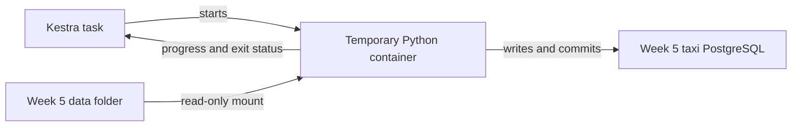

# Week 5 — Part 4: Run the taxi loader from Kestra

[Week 5 overview](README.md) · [Previous: SQL transformation](part-3-sql-transformation.md)

## Goal

Pass the year and month from Kestra to the existing `ingest_months.py` script. Inspect its logs, verify the loaded month in pgAdmin, and repeat the run to check that it does not duplicate the same input data.

This exercise replaces the selected month's records in `public.taxi_trips_monthly`, just as running the monthly loader manually does. It does not use the small `public.taxi_trips` table.

## Opening question — Who should start ingestion?

In Week 2, we started ingestion manually with `docker compose run --rm ingest ...`.

**Discuss with your partner:**

1. Why might relying on a person to start ingestion become a problem when the pipeline needs to run regularly? What happens if nobody starts it or notices a failed run?
2. Which service in this week's [compose.yaml](compose.yaml) could take over starting and monitoring ingestion?

## 1. Understand where the code runs



Kestra starts a container from `deng-week5-ingest:local`. The image contains Python, its libraries, and [ingest_months.py](ingest_months.py). Python connects to the Week 5 taxi database using `postgres:5432`. Kestra's internal database stores execution information instead of taxi trips.

The flow joins the `deng-week5` network and mounts this folder's `data/` directory read-only. Both settings come from the single Compose configuration.

## 2. Prepare the environment

Complete the [startup instructions](README.md) and [downloads](../../preparation/week-05.md). From this Week 5 folder:

```sh
docker build -t deng-week5-ingest:local .
docker compose up -d
```
`docker build` creates an image using the Dockerfile.
The build creates the Python image; it does not load data. The Compose command starts Kestra, its internal database, taxi PostgreSQL and pgAdmin. No other week's environment is needed.

Check that `data/yellow_tripdata_2024-01.parquet` exists. The loader reuses this file; other requested files are downloaded temporarily if missing.

## 3. Complete the ingestion flow

Before opening the flow, read [Reading the taxi ingestion flow](flow-yaml-guide.md). It explains the image, task runner, network, environment variables, volume and entrypoint settings.

Then open [04-load-taxi-month-starter.yaml](flows/04-load-taxi-month-starter.yaml). Create a **new** flow in Kestra and paste the starter into the YAML editor. Keep `taxi_intro` for comparison.

**Your task — about 5 minutes:** replace the two placeholder commands (`echo` and `exit 1`) with one command that runs the monthly loader. Keep `cd /app`.

Your command must:

1. Run `ingest_months.py` with Python.
2. Pass the flow's year input to `--year`.
3. Pass the flow's month input to `--months`.

Use Week 2's terminal command and Part 1's input expressions as references. Do not hard-code January: changing the execution inputs must change the month passed to Python. The starter deliberately fails until you complete it, so an unfinished task cannot report success.

Save your completed flow. The infrastructure settings below are already provided.

| Part of the flow | Purpose |
|---|---|
| `inputs.year`, `inputs.month` | Select the source file to load. |
| `ingest_month` | Our single task. |
| `shell.Commands` | Runs the listed commands and reports a failed command as a task failure. |
| `containerImage` | Uses the image built in Step 2. |
| Docker `taskRunner` | Launches a temporary container to execute the commands. |
| `pullPolicy: NEVER` | Uses the local image; does not try to download it from a registry. |
| `networkMode` | Joins the taxi database network. |
| `entryPoint: []` | Clears the image's default `python` entrypoint so the shell runner can start its command script. |
| `volumes` | Makes the prepared data folder available read-only. |
| `env` | Gives the Python process its database connection settings. |
| `cd /app` | Makes the loader find prepared files in `/app/data`. |

`envs.taxi_db` and the other `envs` values come from environment variables configured for Kestra by Compose. They are different from the year and month inputs selected for each execution.

**Before executing:** with inputs year `2024` and month `2`, write down the Python command you expect Kestra to run. Compare answers with your partner.

<details>
<summary>Hint: using a flow input</summary>

An input expression such as `{{ inputs.year }}` is replaced with the value selected for the execution. Use the corresponding expression for the month.

</details>

## 4. Run January and inspect the logs

Execute `load_taxi_month` with year **2024** and month **1**. Keep the browser open to its execution logs.

Look for:

- `Using prepared file:` — the loader found your downloaded January file.
- Increasing row counts marked `not committed yet`.
- `Committed 2024-01:` — the complete month passed the loader's count check and was saved.
- The task and execution finishing with **SUCCESS**.

The task may take several minutes. This loads the complete monthly file, not just 10,000 rows. If the selected file is absent, the loader downloads it to temporary storage instead; check your folder path if January is unexpectedly downloaded again.

The loader's transaction replaces one month and rolls back if loading or its internal count check fails. Kestra observes the process result; it does not implement that transaction. We have not added automatic retries or schedules yet.

## 5. Verify and run again

In [Week 5 pgAdmin](http://localhost:8086), open the Query Tool connected to the taxi database, run:

```sql
SELECT source_month, COUNT(*) AS loaded_rows
FROM public.taxi_trips_monthly
WHERE source_month = DATE '2024-01-01'
GROUP BY source_month;
```

Record the count and compare it with the loader's final log. Then execute the same Kestra flow again with the same inputs and repeat the query **after the execution succeeds**.

The count should stay the same when the input file is unchanged: the loader replaces that month's rows rather than appending a second copy. You should see two separate executions in Kestra.

**Discuss:**

1. Show the command you wrote. Where do the year/month inputs become Python command arguments?
2. Which component decides whether to commit or roll back the load?
3. Why is a successful Kestra execution followed by a database check useful?

**Finish with:** two successful ingestion executions, the month count from pgAdmin, and an explanation of the rerun behaviour. The next exercise will add a separate validation task.

## If something fails

| Symptom | Check |
|---|---|
| Image not found | Run the image build in Step 2. |
| Network not found or `postgres` cannot be resolved | Run `docker compose up -d` in this Week 5 folder. |
| `envs.taxi_*` is missing | Check this folder's `.env` and run `docker compose up -d`. |
| Docker socket permission error | Check the Docker socket mount in this folder's `compose.yaml`. |
| File mount fails | Check the absolute data path and Docker Desktop's file-sharing access. |
| Database authentication fails | Verify that this folder's `.env` contains the credentials used to initialize the existing taxi database. |
| Monthly replacement times out waiting for a lock | Wait for any other load to finish, and commit or roll back open pgAdmin transactions before retrying. |

## Configuration detective exercise

After completing the ingestion run, inspect this deliberately incorrect configuration:


```yaml
id: taxi_ingestion_wrong_example
namespace: deng.week5

inputs:
  - id: year
    type: INT
    defaults: 2024
    min: 2009
  - id: month
    type: INT
    defaults: 1
    min: 1
    max: 12

tasks:
  - id: ingest_month
    type: io.kestra.plugin.scripts.shell.Commands
    containerImage: deng-week5
    taskRunner:
      type: io.kestra.plugin.scripts.runner.docker.Docker
      pullPolicy: NEVER
      networkMode: "deng-week5-ingest:local"
      entryPoint: []
      volumes:
        - "{{ envs.taxi_data_dir }}:/app/data:ro"
    env:
      POSTGRES_HOST: localhost
      POSTGRES_DB: "{{ envs.taxi_db }}"
      POSTGRES_USER: "{{ envs.taxi_user }}"
      POSTGRES_PASSWORD: "{{ envs.taxi_password }}"
    commands:
      - cd /app
      - python ingest_months.py --year {{ inputs.year }} --months {{ inputs.month }}
```

**Discuss with your partner:**

1. Find the three mistakes marked in the flow. Which value should be the image name, and which should be the network name?
2. Where does `localhost` point when the Python script runs inside its temporary container?
3. Which port should the Python container use to reach PostgreSQL inside the Docker network?
4. What error would you expect first if this flow were executed?

Use the image to fill in the blank labels. Then compare your answers with [Reading the taxi ingestion flow](flow-yaml-guide.md).
