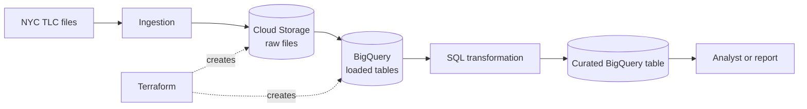

# Week 6 — Cloud platform and Terraform

[Module homepage](../../README.md) · [Downloads before class](../../preparation/week-06.md)

## Goal

Extend the NYC Taxi example from one local database to a small cloud data platform. By the end of the practical, you should be able to:

- distinguish a data lake, data warehouse, and data mart;
- explain the difference between ETL and ELT;
- distinguish infrastructure provisioning from a data pipeline;
- read and write a small Terraform configuration;
- inspect a Terraform plan before creating resources;
- provision a Google Cloud Storage bucket and BigQuery dataset; and
- publish and verify NYC Taxi data using those resources.

## From Week 5 to Week 6

In Week 5, Kestra coordinated tasks that downloaded, transformed, validated, and loaded taxi records into local PostgreSQL. Week 6 introduces cloud storage and a cloud analytical database.

The solid arrows show the **data pipeline**: data moves and changes. The dotted arrows show **infrastructure provisioning**: Terraform creates and configures the places where the data will live. Terraform does not replace ingestion or transformation.

## Planned practical sequence

1. [Map the local pipeline to a cloud platform](part-1-platform-map.md).
2. Write the first Terraform configuration: provider, variables, bucket, and dataset.
3. Use `terraform fmt`, `validate`, and `plan` before creating resources.
4. Apply the configuration and inspect the resources in Google Cloud.
5. Publish NYC Taxi data and verify it in BigQuery.
6. Change, inspect, and finally remove the infrastructure safely.

Only Part 1 is released at this stage. Later parts will be added and the [Week 6 preparation](../../preparation/week-06.md) will then identify the exact provider download required before class.

## Project connection

Terraform and cloud resources are final-project requirements; they are not required for the Week 7 midterm repository. The midterm submission still assesses the reproducible local ingestion and orchestration pipeline. Its repository URL and assessed commit hash or release tag are due on **22 October 2026 at 15:30 Europe/Zurich**, before the Week 6 session.

