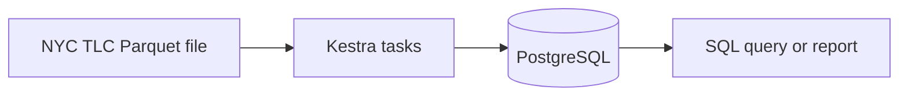

# Week 6 — Part 1: Map the local pipeline to a cloud platform

[Week 6 overview](README.md)

## Goal

Decide what each cloud component does before configuring it. This activity does not create resources or move data.

## 1. Start with the local pipeline

The Week 5 pipeline can be summarized as:

PostgreSQL holds both the loaded records and the tables queried by a consumer. This is suitable for the local exercise, but the final project also requires cloud object storage and a cloud warehouse.

## 2. Meet the cloud components

| Term | Meaning in this practical | NYC Taxi example |
|---|---|---|
| Data lake | Stores files in their original or lightly processed form. | Parquet files in a Google Cloud Storage bucket. |
| Data warehouse | Stores structured data for analytical SQL queries. | Tables in a BigQuery dataset. |
| Data mart | A focused, curated part of warehouse data for a particular consumer or topic. | A daily pickup-zone table for an analyst. |

A **Cloud Storage bucket** is a container for objects such as Parquet files. A **BigQuery dataset** is a namespace that groups BigQuery tables and views. The word `dataset` therefore has a specific BigQuery meaning here; it is not the taxi file itself.

## 3. Distinguish ETL and ELT

The letters describe when transformation happens:

| Pattern | Order | Example |
|---|---|---|
| ETL | Extract → Transform → Load | Python changes the taxi data before loading the result into PostgreSQL. |
| ELT | Extract → Load → Transform | Load source records into BigQuery, then use SQL in BigQuery to create a curated table. |

ELT does not mean that source data needs no validation or that every value should be exposed to every user. It means the main business transformation runs after data reaches the analytical platform.

## 4. Complete the architecture

Copy this table into your notes and fill the empty cells before looking back at the Week 6 overview.

| Stage | Tool or location | What happens? |
|---|---|---|
| Source | NYC TLC | Monthly Parquet files are published. |
| Ingestion | __________ | The selected file is acquired and transferred. |
| Raw storage | __________ | The source file is retained as an object. |
| Warehouse load | __________ | Source records become queryable with SQL. |
| Transformation | __________ | SQL applies quality and reporting rules. |
| Serving | __________ | A consumer queries a curated table. |

Add two different arrow styles to your drawing:

1. solid arrows for movement or transformation of data;
2. dotted arrows from Terraform to resources that Terraform creates.

**Checkpoint:** Which boxes contain data, and which action only creates an empty place where data can later be stored?

## 5. Decide what Terraform should manage

Classify each action as **infrastructure** or **data pipeline**:

1. Create a Cloud Storage bucket.
2. Download a monthly taxi file.
3. Create a BigQuery dataset.
4. Upload a Parquet file.
5. Transform loaded records with SQL.
6. Configure the Google Cloud region for a dataset.
7. Validate that the curated table contains records.

Terraform will manage actions 1, 3, and 6 in this practical. The pipeline will perform actions 2, 4, 5, and 7. Keeping these responsibilities clear makes it easier to reason about failures: an empty bucket may mean provisioning succeeded while ingestion failed.

## Discuss

1. Why keep the source Parquet file after loading records into BigQuery?
2. If a SQL transformation is incorrect, which stored copy would let you create the curated table again?
3. Why should students inspect a Terraform plan before applying it?
4. Which part of this design supports a specific consumer: the raw bucket, the loaded source table, or the curated table?

**Finish with:** one labelled architecture containing the source, ingestion, Cloud Storage, BigQuery source table, transformation, curated table, consumer, and Terraform.

